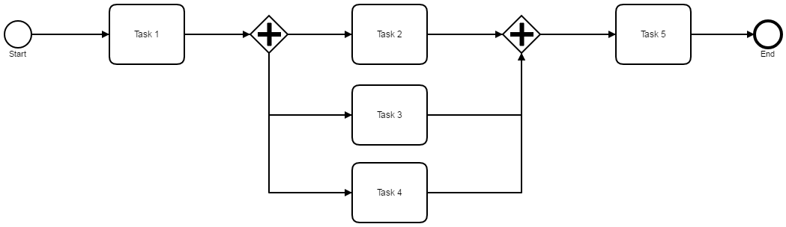
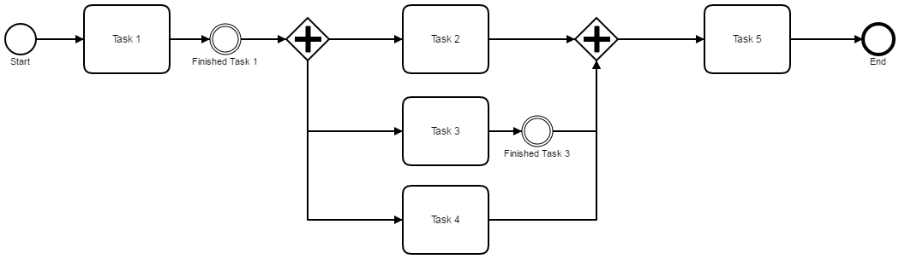
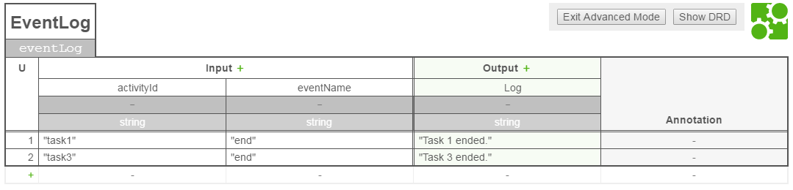

# Customizable Event Log inside Camunda BPM  process

```
Context  : Business Process Management (BPM) / Decision Management (DM)  
Framework: Camunda (https://camunda.org/)
```

## The problem

A BPM (Business Process Management) process exists of lots of flow objects (activities, events, gateways) and at some point of execution - for example when a user is prompted to perform a task - an information about "what happend so far" is helpful or even required.

Looking at the following process



it might be helpful in _Task 5_ just to know that _Task 1_ and _Task 3_ happend. _Task 5_ could be a user task and of course the process should provide all information needed to complete this task. However, the complete process flow may not be known to the user and information about some things that happened might be useful.

Let's call the "what happend so far" information *Event Log* and let's consider how to get this information.

## possible Solutions (not discussed here)

There are several options I can imagine to assemble the Event Log information.

**query the history**

Camunda BPM offers a ([History and Audit Event Log](https://docs.camunda.org/manual/latest/user-guide/process-engine/history/)). This offers access to all interesting data of a process execution and you'll probably find what you're looking for. But it may be too complex and the processing of the results for the required information can be cumbersome.

**hold an own "Event Log" managed by Intermediate None Events**

You can use [Intermediate None Events](https://docs.camunda.org/manual/latest/reference/bpmn20/events/none-events/#intermediate-none-event-throwing) at special points of interest in your process flow (see below).



 There you can hook in code that manages an own Event Log (probably added as process variable to the process instance). The Event Log can be easily made available to interesting clients (e.g. a User Interface that supports to handle a User Task). I somehow like that the "special events" are clearly visible in the process model, but strictly speaking they are not really important to the process. Moreover they are not very flexible and if a "point of interest" changes the process flow needs a change as well.

## using Decision Management to manage an own "Event Log"

I finally found a way to use a decision table for my goal to manage a *Custom Event Log* for a running process. My DMN diagram looks like that:

 

The rules in the diagram define _Events_ that I would like to handle in a special case. An _Event_ is specified by the _activityId_ and the _eventName_ as they occur in the process. The output of a rule is just a simple message that I can add to my Custom Event Log_.

On the Java Code side I implemented a [GlobalExecutionListener](src/main/java/de/frvabe/bpm/camunda/GlobalExecutionListener.java). This listener listens to each activity event that is executed by the process and if an activity/event matches a DM rule a custom treatment can be done. In my original use case I just add the rule output to a list of Strings. This list makes up my "Event Log" and I put it as a process variable to the process instance.

In the example code (see snippet below) here I just print the output message to the console.

```java

    @Override
    public void notify(final DelegateExecution execution) throws Exception {
        System.out.println("Entering activity (activitId=" + execution.getCurrentActivityId()
                + ", eventName=" + execution.getEventName() + ") ...");
        handleEventLog(execution);
    }

    /**
     * Checks if the current execution matches the configuration. If {@code yes} performs desired
     * operation; here just prints a message that was specified in the DMN model.
     *
     * @param execution the current execution
     */
    private void handleEventLog(final DelegateExecution execution) {
        if (execution.getCurrentActivityId() != null && execution.getEventName() != null) {
            VariableMap variables =
                    Variables.putValue("activityId", execution.getCurrentActivityId())
                            .putValue("eventName", execution.getEventName());
            DmnDecisionTableResult result =
                    dmnEngine.evaluateDecisionTable(eventLogDecision, variables);
            if (!result.isEmpty()) {
                // the configuration matched the event
                System.out.println(">>> " + result.getSingleEntry().toString());
            }
        }
    }
```

Oh, how did I manage to attach the Listener to all process activities? My project is a Spring Boot project using the [camunda-bpm-spring-boot-starter](https://github.com/camunda/camunda-bpm-spring-boot-starter)). My Main class (wich is also the root of my Spring context configuration) extends the [SpringBootProcessApplication](https://github.com/camunda/camunda-bpm-spring-boot-starter/blob/master/extension/starter/src/main/java/org/camunda/bpm/spring/boot/starter/SpringBootProcessApplication.java) and overrides the _getExecutionListener_ method (therefore the [Process Engine Plugin](https://docs.camunda.org/manual/latest/user-guide/process-applications/process-application-event-listeners/) needs to be activated). How simple is that?

```java
package de.frvabe.bpm.camunda;

import org.camunda.bpm.application.ProcessApplication;
import org.camunda.bpm.engine.delegate.ExecutionListener;
import org.camunda.bpm.spring.boot.starter.SpringBootProcessApplication;
import org.springframework.boot.SpringApplication;
import org.springframework.boot.autoconfigure.SpringBootApplication;

/**
 * The core Spring Application configuration.
 */
@SpringBootApplication
@ProcessApplication
public class Main extends SpringBootProcessApplication {

    @Override
    public ExecutionListener getExecutionListener() {
        return new GlobalExecutionListener();
    }

    public static void main(final String... args) {
        SpringApplication.run(Main.class, args);
    }

}
```

## Conclusion

I think I found an interesting approach to implement something that I would call a "Custom EventLog" using BPM and DM.

But - to be honest -  I am not really sure if this is the way to go. Some disadvanteges I see are
* overhead of (useless) GlobalExecutionListener invocations and rule processing
* the GlobalExecutionListener might be better used to do something else (and I only have one)
* ...

So - if you could follow me - I would **love to here your opinion** about my approach. Feel free to contact me at Twitter (@FrVaBe) or open an issue here with your comment.

If you want to have a deeper look at the solution just clone the project. The `camunda-customizable-event-log` contains a complete Maven project where you can find a unit test that starts a process and observe the behavior.
