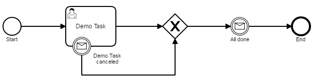

# camunda-event-demo

This is a project to demonstrate the use of events.
Content will be added as needed.

## Message Boundary Catch Event

<table>
  <tr>
    <th>BPMN</th>
    <th>Code Example</th>
  </tr>
  <tr>
    <td>
      <a href="src/main/resources/bpmn/demoProcessWithMessageBoundaryCatchEvent.bpmn">demoProcessWithMessageBoundaryCatchEvent.bpmn</a>
    </td>
    <td>
      <a href="src/test/java/de/frvabe/bpm/camunda/MessageBoundaryCatchEventTest.java">de.frvabe.bpm.camunda.MessageBoundaryCatchEventTest</a>
    </td>
  </tr>
  <tr>
    <td colspan="2" align="center">
      
    </td>
  </tr>
</table>
