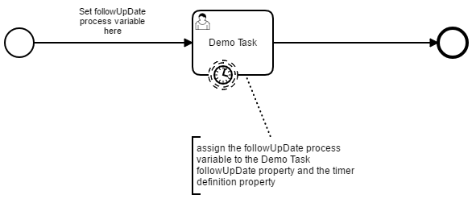

# camunda-user-task-demo

User tasks (in general) often work with follow-up or due dates. [Camunda BPM](https://camunda.org/) does support this by providing corresponding properties / members on the [User Task BPMN element](https://docs.camunda.org/manual/7.6/reference/bpmn20/tasks/user-task/).
The Camunda API allows to filter user tasks by these dates so that due or overdue tasks can be found easily.

Beside the query filter also [Timer Boundary Events](https://docs.camunda.org/manual/7.6/reference/bpmn20/events/timer-events/#timer-boundary-event) on user tasks can be used to "detect" the maturity of a user task and to trigger an automatic action.

This modul demonstrates the use of the timer boundary events in two different "flavours".

## Timer Boundary Event with Time Date

In the following process model the boundary timer event is defined with a [Time Date](https://docs.camunda.org/manual/7.6/reference/bpmn20/events/timer-events/#time-date). This date represents the time when the event will be fired.
The challenging aspect is to bring the timer date in sync with the follow-up (or due) date from the User Task.

   
**Figure 1:** demo process with timer date ([BPMN model](src/main/resources/bpmn/demoProcessWithTimerDate.bpmn))

The user task should be followed-up after a specific period of time after the user task started. This can be configured in the BPMN Model. But to have the boundary timer event fired on the same date, the date definition has to be configured on the timer event as well. Thus we need to - _manually_ - keep two date definitions of the model in sync - which is hard.
A nicer approach is to define the follow-up date as a process variable in the process flow element that points to the user task, like it is done in the example on a listener of the sequence flow element like this

```java
${execution.setVariable('demoTask.followUpDate', dateTime().plusSeconds(5).toDate())}
```  

This defines a `demoTask.followUpDate` process variable with the time "5 seconds from now" (short period for testing purpose). The user task and the boundary timer event now can use this variable to set the follow-up date and the timer date with

```java
${execution.getVariable('demoTask.followUpDate')}
```

Have a look at the model for details on this configuration. The timer - by the way - is a none interrupting timer in this model and the action that should be triggered when the timer fires is expected to be implemented in a listener (here [DemoTaskBoundaryTimerListener](src/main/java/de/frvabe/bpm/camunda/DemoTaskBoundaryTimerListener.java)). You can also use an interrupting timer event of course to interrupt the activity and to continue the process on an alternative process path.

**Resources of this example:**
* BPMN model ([demoProcessWithTimerDate.bpmn](src/main/resources/bpmn/demoProcessWithTimerDate.bpmn))
* Timer Event Listener ([DemoTaskBoundaryTimerListener](src/main/java/de/frvabe/bpm/camunda/DemoTaskBoundaryTimerListener.java))
* JUnit test ([UserTaskTest.timerWithTimeDate()](src/test/java/de/frvabe/bpm/camunda/UserTaskTest.java))

## Timer Boundary Event with Time Cycle

Another approach to model a follow-up date with an automatic corresponding action is to define the follow-up date on the user task and to monitor the maturity in a timer that is defined with a [Timer Cycle](https://docs.camunda.org/manual/7.6/reference/bpmn20/events/timer-events/#time-cycle).

This is done in the following example.

   
**Figure 2:** demo process with timer cycle ([BPMN model](src/main/resources/bpmn/demoProcessWithTimerCycle.bpmn))


The follow-up date is set on the user task this way

```java
${dateTime().plusSeconds(5).toDate()}
```

and the timer definition is a cron expression which will make the timer fire every second

    0/1 * * * * ?

Each time the timer is fired it will check if the follow-up date has already been reached. In case it has, a special event handling can be implemented (e.g. change or reset the assignee).

The hard part is to get the value of the follow-up date of the user task inside the listener code of the timer. This could be done like this (thanks [throben](https://forum.camunda.org/t/get-user-task-of-timer-boundary-event/2744) for the help)

```java   
        // fetch the BPMN model ID of the timer event
        String timerEventId = execution.getCurrentActivityId();

        // get the task this timer event is attached to
        Job timerJob = execution.getProcessEngineServices().getManagementService().createJobQuery()
                .activityId(timerEventId).singleResult();
        Task task = execution.getProcessEngineServices().getTaskService().createTaskQuery()
                .executionId(timerJob.getExecutionId()).singleResult();

        // check if the follow-up date was reached
        if (task.getFollowUpDate() != null && task.getFollowUpDate().before(new Date())) {
            LOGGER.info("the follow up date (" + task.getFollowUpDate()
                    + ") of the User Task was reached");
            execution.getProcessEngineServices().getRuntimeService().setVariableLocal(
                    task.getExecutionId(), "demoTaskBoundaryEvent.followUpDateReached", true);
        }
```

Note: The timer fires way to often (more than once a second) in this example. I am not sure why, maybe the interval is too small or I made a configuration mistake. In production code it will probably be OK to have a way more "relaxed" timer cycle.

**Resources of this example:**
* BPMN model ([demoProcessWithTimerCycle.bpmn](src/main/resources/bpmn/demoProcessWithTimerCycle.bpmn))
* Timer Event Listener ([DemoTaskBoundaryTimerListener](src/main/java/de/frvabe/bpm/camunda/DemoTaskBoundaryTimerListener.java))
* JUnit test ([UserTaskTest.timerWithTimeCycle()](src/test/java/de/frvabe/bpm/camunda/UserTaskTest.java))
